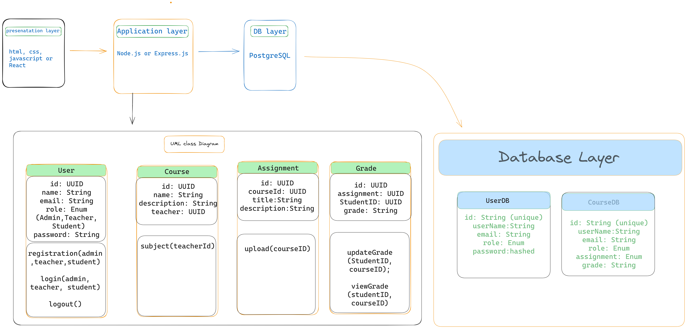

## mentee-LMS 

### HLD
1. Define functional and non-functional Requirement 

> Functional Requirement 
1. Authentication and Authorization 

    Login, logout, and role-based access(Admin, Teacher, Student).
2. Course Management
    Add, update, delete and list courses (Admin, Teacher, Student)

3. Assignment Management  

    Upload download, and grade assignments (Teachers and Student roles)

4. Student Management 
    View and manage student details (Admin)

5. Notification 
    Nofity student of new assignment or grade

6. Reporting 
    View student performance reports (Admin and Teacher roles)

> Non-Functional Requirements
1. Scalability: Support for increasing numbers of student, course, and assignments.
2. Performance: API responses within 200ms for standard operations.
3. Security: Implement JWT for secure communication.
4. Reliability: 99.9% uptime SLA.
5. Maintainability: Modular architecture for easy updates and debugging.

> System Overview
The LMS consists of three main layer
1. Presentation layer: Frontend (HTML,CSS, and javaScript).
2. Application layer: Node.js with Express.js as the backend framework.
3. Database layer: PostgreSQL for data storage.

### Key Components
1. Authentication Service: Handles login, logout and token validation.
2. Assignment Service: Handles assignment uploads, downloads, and grading.
3. Notification Service: Sends emails or push notifications.
4. Student Service: Manages students information and performance data.

> Communication Between Components
REST APIs: Each service exposes endpoints.
Event-Driven Architecture: Use a message braker like RabbitMQ for notifications.

### LLD (Low-Level Design)
Entity Relationship Diagram (ERD)

> Entities: Users, Courses, Assignment, Grades, Notification
> RelationShips: 
1. A user can enroll in multiple courses.
2. A course can have multiple assignments.
3. An Assignment can have one Grade for each Student.

> UML Diagram

### API Endpoints (Postman)
1. POST /auth/login
2. GET /courses
3. POST /assignments
4. POST /assignments/:id/grade

